# **LendingClub Loan Data**

* Name: **Alex Husted**
* Project Start Date: **Tuesday October 1, 2019**
* Project Finish Date: **Tuesday October 8, 2019**

# **Project Overview**

This notebook represents a project dedicated to the LendingClub Loan Data. LendingClub is a US peer-to-peer lending company, headquartered in San Francisco, California. LendingClub is the world's largest peer-to-peer lending platform. LendingClub enables borrowers to create unsecured personal loans between 1,000 and 40,000 dollars. The standard loan period is three years. On the basis of the borrower’s credit score, credit history, desired loan amount and the borrower’s debt-to-income ratio, LendingClub determines whether the borrower is credit worthy and assigns to its approved loans a credit grade that determines payable interest rate and fees.

Within this project, I will intend to build a machine learning algorithm for the purpose of correctly identifying whether a person, given certain characteristics, has a high likelihood to default on a loan. There is a certain methodology that needs to be followed in order to properly load effective predictors - data cleaning, exploration, and feature engineering.

## About the dataset

Looking into the dataset, the files contain complete loan data for all loans issued through the 2007-2015, including the current loan status (Current, Late, Fully Paid, etc.) and latest payment information. Additional features include credit scores, number of finance inquiries, address including zip codes, and state, and collections among others. There are 145 columns with information representing individual loan accounts. Each row is divided by an individual loan id and member id, of course, for the interest of privacy each member id has been removed from the dataset. Below you can identify some (not all) columns within the dataset.

## Columns

    * id
    * member_id
    * loan_amnt
    * funded_amnt
    * funded_amnt_inv
    * term
    * int_rate
    * installment
    * grade
    * sub_grade
    * emp_title
    * emp_length
    * home_ownership
    * annual_inc
    * verification_status
    * issue_d
    * loan_status
    * pymnt_plan
    * url
    * desc
    
Here is a link to an attribute summary of the columns within this dataset: https://www.rubydoc.info/gems/lending_club/0.0.2/LendingClub/Loan

# **Project PreWork**

Before moving forward with machine learning modeling, there are necessary steps to become familiar with the LendingClub dataset. First, importing libraries and necessary data files needed to complete an exploratory analysis of the data would be helpful. Then it's important to examine the features within the dataset. What are the qualities of each loan? What characteristics make them similar or different? What is the most effective method to clean the dataset? How can the data be best explained? What characteristics are most important for classification? Questions like these will help develop a better understanding of the dataset and will eventually guide effective machine learning.

## Data Cleaning

There seems to be many columns with null values. It would be interesting to identify the percentage of null values in each column in order to drop certain columns that don't meet a percentage threshold. 

There are many columns within the dataset, more than I was familiar with. In the above dataframe, this displays each column name with a representative value that outlines the percentage of missing values within that specific column. 100% means this column contains no values. 0% means the column is not missing any values. I would like to create a new dataframe that contains only columns with 75% or greater value retention. 

After selecting appropriate columns, the data types need some tweaking. Some columns contain characters that need to be removed and others contain null values that can be removed. 

# **Exploring LendingClub**

Exploratory Data Analysis, or EDA, is an integral part of understanding the LendingClub dataset. Before moving towards classification, it's vital to become familiar with different relationships within the data. Analyzing these relationships will provide intuition about how to interpret the results of the proceeding models. Asking questions about these relationships beforehand might also supply additional knowledge about relationships that we might have not known existed. This section will further investigate the distribution of data and ask specific questions about the information lying inside the dataset.

## Loan Distributions

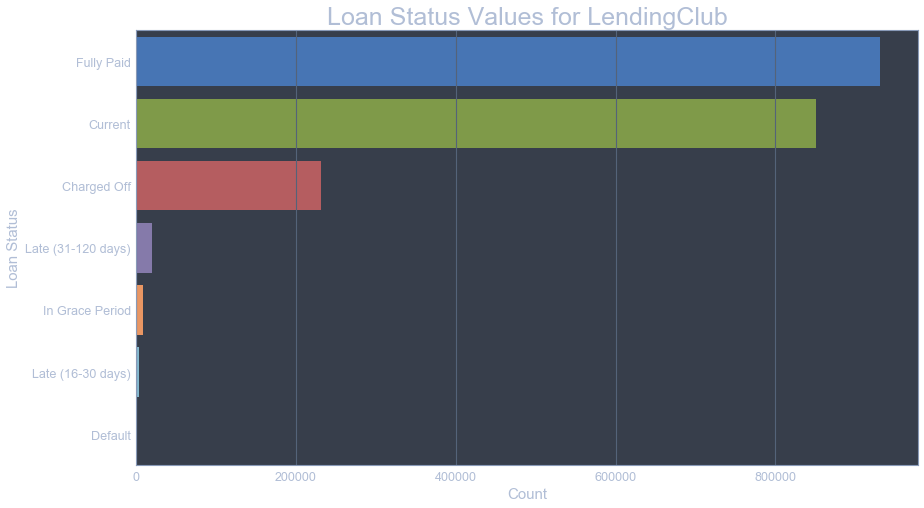

The two columns that we are looking at for the future model are 'current' and 'default'. It's clear to see there will be class imbalances that need to be dealt with. In this bar plot, most records contain loans that have been fully paid or currently in status. 

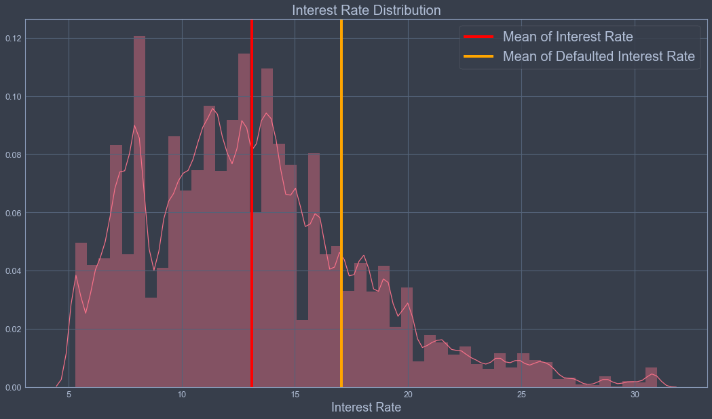

This plot identifies the distributions of loan interest rate records within the dataset. The solid red line represents the mean interest rate for all loans. The solid orange line represents the mean interest rate for loans that have been defaulted. There is a clear 3.95% increase in interest rate between defaulted loans vs. non-defaulted.

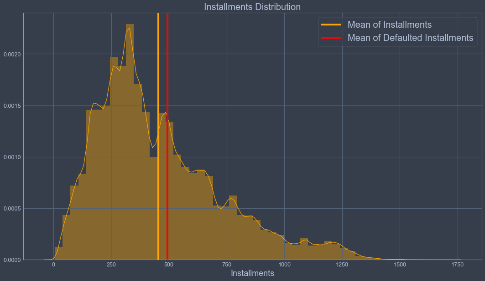

Here we see the distributions of loan installment records within the dataset. The solid orange line represents the mean of installments for all loans. The solid red line represents the mean installment value for loans that have been defaulted. Looking at the print statement, the average installment value is 40 dollars higher than the average non-defaulted loan. 

## Loan Grades

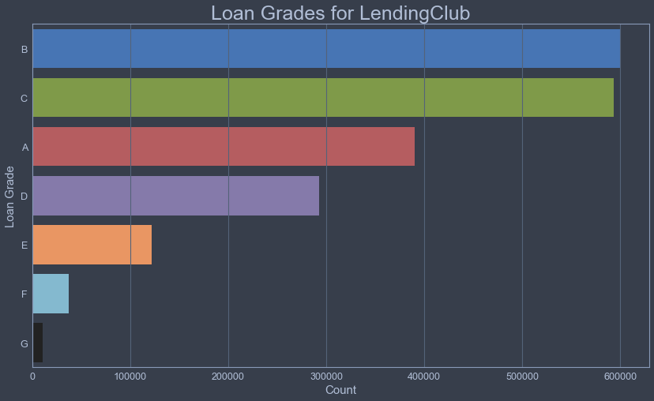

Here is a simple count plot for loan grades within the dataset. The most popular grades are B and C. A-graded loans come third. There are few F and G graded loans, probably for the best. However it is important to notice that B and C graded loans occur more often than top rated 'A' loans. 

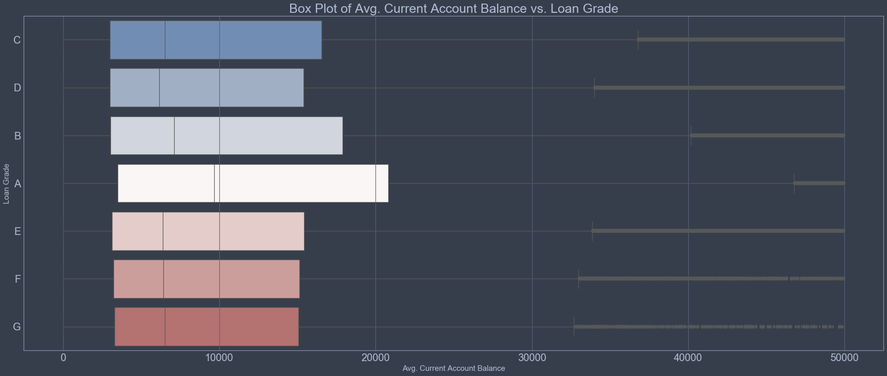

Unsurprisingly, the average current bank account balance for borrowers is the highest in grade A loans. B-graded loans are second. It's nice to see this represented visually in this box plot format. 

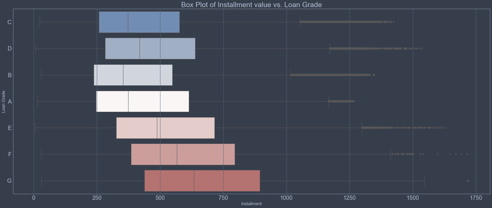

The lowest rated loans have the highest average installments. Average installments seem to increase from D-grade moving down to G-grade. The average installment for G-graded loans is around 625 dollars and for A-graded loans, 350 dollars. 

## Other Loan Features

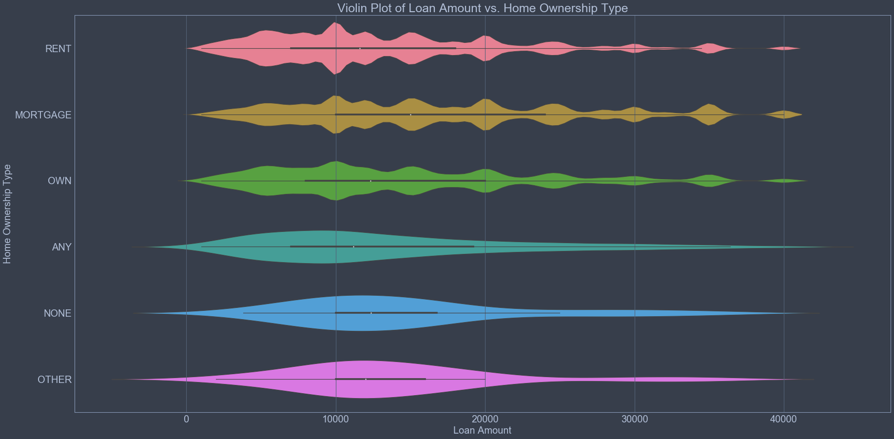

This plot identified the mean and density distribution for loan amounts per home-ownership type. Borrowers can be categorized into seven ownership types. Borrowers with mortgages have the highest average loan amount and those who rent have the lowest loan amount for analytical categories. 

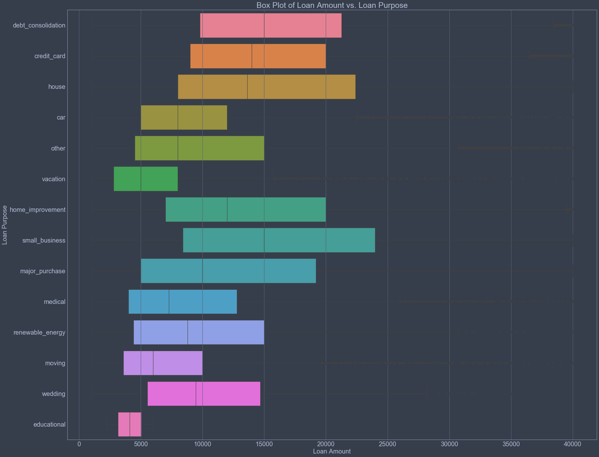

The loan purpose column is broken down into 14 categorical values. Debt consolidation and small business loans have the highest average loan amount compared to other categories with around a 15,000 dollar average. Surprisingly, educational loans have the smallest average loan amount with a 4,500 average, just slightly lower than vacational loans. 

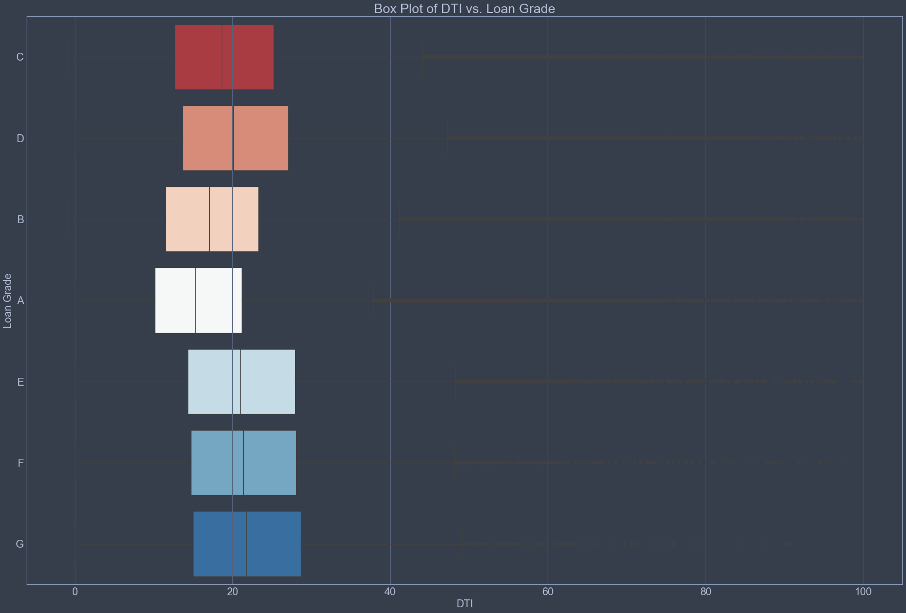

The DTI feature can be calculated by taking monthly payments on the total debt obligations, excluding mortgage, divided by self-reported monthly income. Looking at this box plot, having a lower DTI results in a better loan grade. on the contrary, borrowers who own grade 'G' loans have the highest average DTI.

## Correlation Matrix

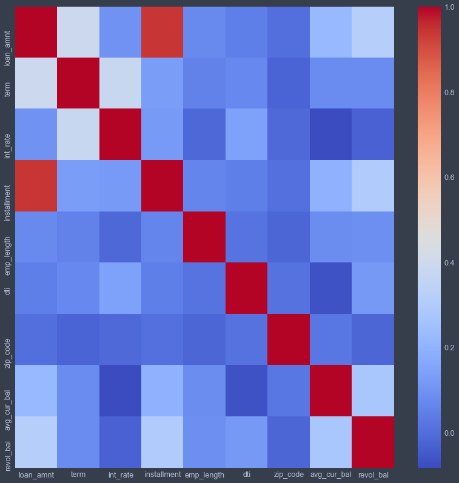

There is a strong correlation between installment values and loan amount. This multicollinearity should be removed in the following model because these two values explain the data in the same manner. I would be overfitting the model if both of these features are contained in the final model. Most machine learning models carry assumptions which calls for little multicollinearity. 

# **ML Modeling**

Machine learning is about prediction and pattern recognition. ML algorithms observe patterns and learn from them. When you deploy a ML program, it will keep learning and improving on each attempt. To gauge the effectiveness of the model, it's vital to first split the data into training and test sets, or perhaps use cross-validation techniques to further segment the dataset into composite sets of training and test sets. Then it's important to implement a choice selection of performance metrics that are tied into the initial problem statement. In this case, I would like to identify whether a borrower is going to default on a loan or not. Model accuracy might not be the sole metric to identify - the F1 score and confusion matrix should be viable metrics to analyze as well. What's important is to chose the right performance measures for the right situations. 

## Model Preparation

For now I will drop all the columns except 'Fully Paid', 'Default' and 'Charged off'. I will also merge 'Charged off' and 'Default' together meaning that anyone who fell into this category defaulted their loan. A charge-off is a debt that a creditor has given up trying to collect on after the borrower has missed payments for several months. This categorization helps break the data into a binary column.

Now encoding the two categories listed above as 0 or 1. This will help in predicting whether a person defaulted their loan or not. 0 means the borrower has defaulted and 1 means the borrower paid off the loan.

Before training, I would first need to transform the data to account for any skewness in the variable distribution. For this type of problem, box-cox transformation could seem like a viable method. It's used to modify the distributional shape of a dataset for the purpose of normally distributing so that tests and confidence limits that require normality can be appropriately used.

## Model Selection

It's now time to test the cleaned and prepared dataset on various machine learning methods to identify which model and metrics work best. First, let's build a model on the imbalanced dataset. Then lets tame the class imbalances by using equal amount of default and 'fully paid' loans. The function below computes the receiver operating characteristic (ROC) curves for each of the models. This function will be called later in the model performance analysis.

Let's try some models on the train dataset With 3 fold cross validation. I am going to use the following 4 machine learning algorithms:

Linear Discriminant Analysis --> Projecting a dataset onto a lower-dimensional space with good class-separability in order avoid overfitting.
Multinomial Naive Bayes --> Applying Bayes theorem with a strong(naive) assumption, that every feature is independent of the others, in order to predict the category of a given sample.
Random Forest --> Consists of a large number of individual decision trees that operate as an ensemble.
Binary Logistic Regression --> Used to describe data and to explain the relationship between one dependent binary variable.

It seems logistic regression has achieved the best score  in each of the model iterations with a metric of 80.29. 

### Unbalanced

The cross-validation scores and ROC curves suggest the Logistic Regression is the best model, though the MNB and LDA models are pretty close behind. If we look at the confusion matrix, though, we see a big problem. The model can predict who are going to pay off the loan with a good accuracy of 99% but cannot predict who are going to default. The true positive rate of default (0 predicting 0) is almost 0. Since our main goal is to predict defaulter's, we have to do something about this.

The reason this is happening could be because of high imbalance in our dataset and the algorithm is putting everything into 1. I have to chose a new prediction threshold according to the sensitivity and specificity of the model. This will create some balance in predicting the binary outcome. Let's look at the plots below.

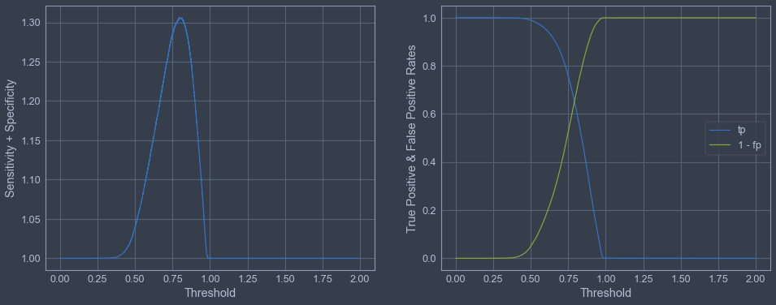

The optimal threshold above is where the the two graphs meet.

Sensitivity (also called the true positive rate or recall) measures the proportion of actual positives that are correctly identified as such (e.g. the percentage of borrowers who are correctly identified as defaulters).

Specificity (also called the true negative rate) measures the proportion of actual negatives that are correctly identified as such (e.g. the percentage of borrowers who are correctly identified as paying the loan back).

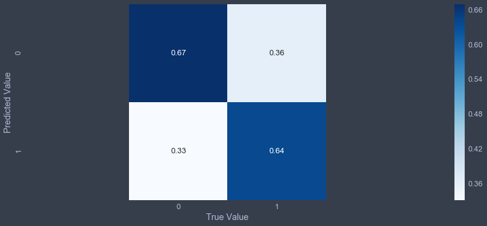

The optimum threshold for the classifier has increased the models' prediction power of Default (0). Even now the model doesn't provide a lot of prediction power and we have to train the model again using a different algorithm with some tweaks.

### Balanced

Logistic regression seems to still achieve the best score after we have balanced the data. Notice that the score has decreased in this iteration. This is actually a good thing because we can now understand that the model is being trained under appropriate circumstances. 

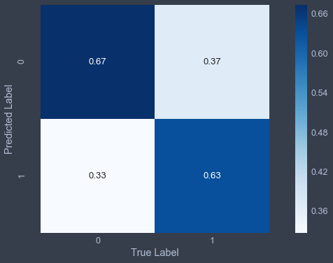

This is a significant improvement over the last model. Here our true positive rate is 67% and our true negative rate is 64%. The false negative rate, the metric that predicts whether a borrower will not default on their loan when in fact they do, is minimized to 33%. 

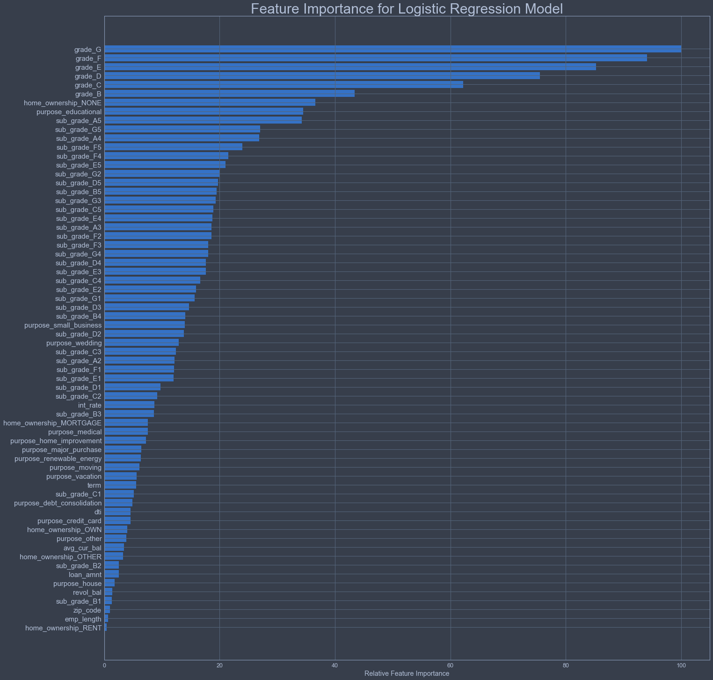

According to the feature plot above, loan grade has the highest importance that determines whether a borrower could default of not. Further, if the borrower does not own a home is a good indicator whether he/she will default on the loan. If the borrower is using the loan for educational purposes, then there is a higher likelygood that the loan will be defaulted. Small business and wedding loans are also a factor. Moving down the list we see interest rates, installment amounts becoming a factor. Medical loans are also an indicator for defaults. 

# **Conclusion**

The aim of this project was to explore, analyze and build a machine learning algorithm for the purpose of correctly identifying whether a person, given certain characteristics, has a high likelihood to default on a loan. This type of model could be used by LendingClub to identify certain financial traits of future borrowers that could have the potential to default and not pay back their loan. 

The best scoring metrics for the model was the roc_auc_score as well as the confusion matrix. The Receiver Operating Characteristic (ROC) curves and AUC values are often used to score binary classification models AUC is good for classification problems with a class imbalance - the cost of a false positive is different from the cost of a false negative. AUC is not directly comparable to accuracy, precision, recall, or F1-score. When looking at our confusion matrix, our true positive rate is 67% and our true negative rate is 64%. The false negative rate, the metric that predicts whether a borrower will not default on their loan when in fact they do, is minimized to 33%.

According to the feature plot, loan grade has the highest importance that determines whether a borrower could default of not. Further, if the borrower does not own a home is a good indicator whether he/she will default on the loan. If the borrower is using the loan for educational purposes, then there is a higher likelygood that the loan will be defaulted. Small business and wedding loans are also a factor. Moving down the list we see interest rates, installment amounts becoming a factor. Medical loans are also an indicator for defaults.

## Recommendations

* LendingClub must be careful when identifying potential borrowers who fit certain criteria. For example, borrowers who do not own a home *and* are applying for a small business or wedding loan, this could be a negative combination that results in the borrower defaulting on a future loan. 

* Looking into the distribution plot from data exploration, borrowers who end up defaulting on their loan are continuously paying higher interest rates and larger installments. LendingClub should be weary of not combining these two metrics, especially if potential borrowers are applying for a 'non-so likely' loan purpose (such as educational or medical). 

* LendingClub must be aware that low graded loans, undeniably, have a higher chance of default probability. They should be willing to work with these borrowers to ensure they are making adequate and timely payments. Possibly reducing interest rates or installments for these clients could help. 

## Further Work

One of the drawbacks is simply the limited number of people who defaulted on their loan in the 8 years of data (2007-2015). We could use an updated data frame which consists of the next 3 years values (2015-2018) and see how many of the current loans were paid off, defaulted, or even charged off. Then, these new data points can be used for prediction or and training new models.

Since the algorithm puts around 36% of non-defaulters in the default class, we might want to look further into this issue to help the model accurately predict capable borrowers.
